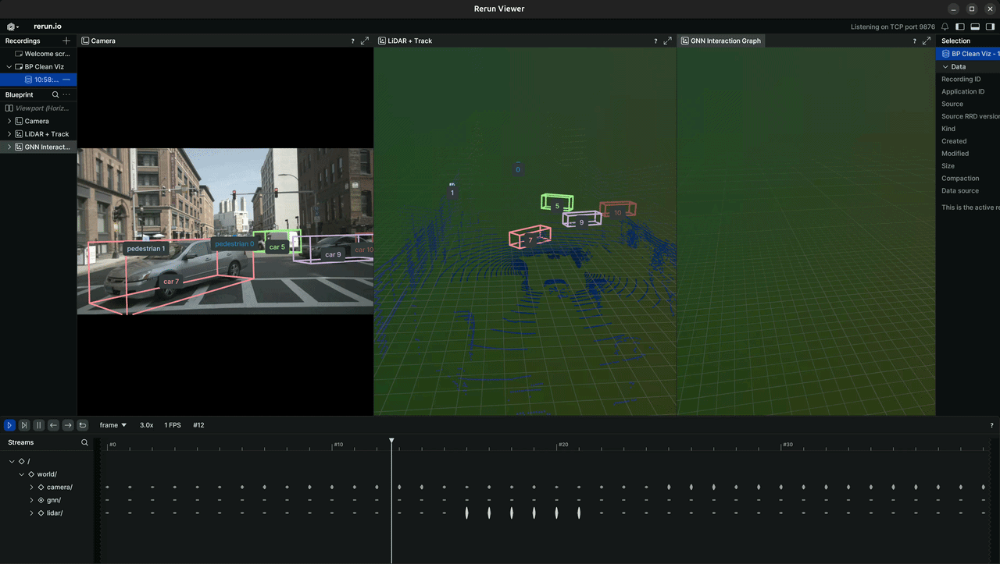

# End-to-End Trajectory Prediction System

> From raw RGB images to uncertainty-aware multi-agent trajectory forecasting for autonomous vehicles.

---

## Overview

This project implements a full autonomous driving perception and prediction pipeline, developed as part of my M.Sc. thesis at  **Deep Safety GmbH**.
The pipeline takes monocular camera images as input and outputs calibrated multi-agent trajectory predictions with uncertainty estimates. The system is designed with real-world deployment in mind, not just benchmark performance.

---

## Pipeline

The system is composed of three sequential stages:

**1. 3D Object Detection**
- Model: CenterPoint (camera-based)
- Detects and localizes agents in 3D space from RGB input
- Outputs: 3D bounding boxes, velocity estimates, class labels

**2. Multi-Object Tracking**
- Custom Kalman Filter tracker built from scratch
- Greedy Nearest Neighbour algorithm for data association
- **AMOTA: 0.929** on nuScenes 
- Outputs: Consistent agent trajectories over time with tracker covariance

**3. Multi-Agent Trajectory Prediction**
- GATv2-based Graph Neural Network for agent interaction modeling
- 6-mode multimodal predictions over a 3-second horizon with 2-second history horizon
- Three-layer uncertainty quantification:
  - **U1**: Tracker covariance propagation
  - **U2**: Aleatoric uncertainty via Laplace Mixture Model
  - **U3**: Epistemic uncertainty via MC Dropout

---

## Key Results

| Metric | Value |
|---|---|
| Tracker AMOTA | 0.929 |
| minADE (best mode) | 0.539 m |
| FDE k=1 | 1.156 m |
| NLL | −6.515 |
| ECE | 0.0283 m |

---

## Tech Stack

**ML:** Graph Attention Networks (GATv2) · Kalman Filtering · Laplace Mixture Model · Multimodality · Uncertainty Quantification

**Dataset:** nuScenes (autonomous driving benchmark, 1000 scenes)

**Visualization:** Rerun.io

---

## Author

**Aryaman Mahajan**

